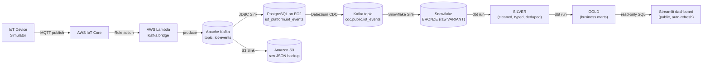
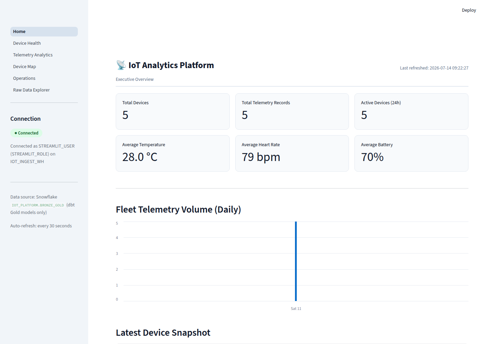
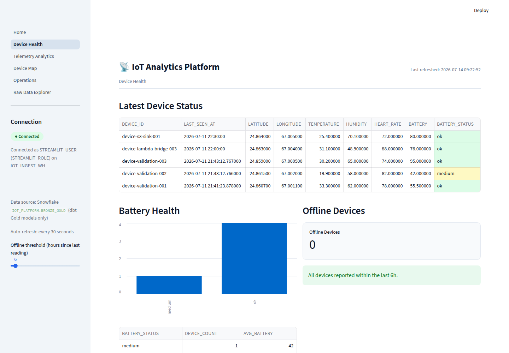
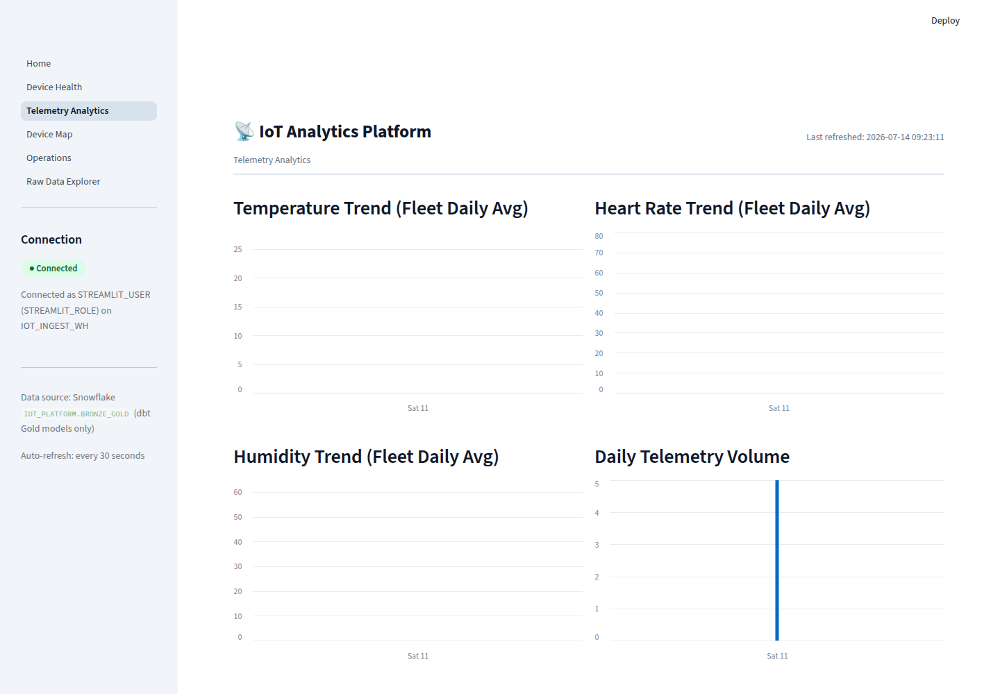
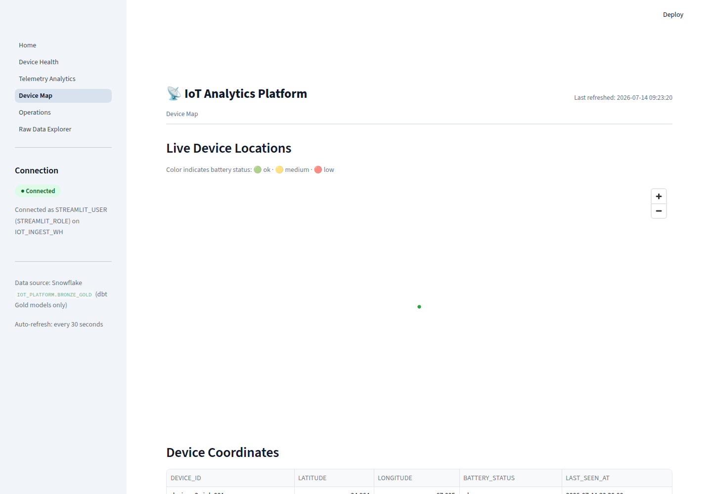
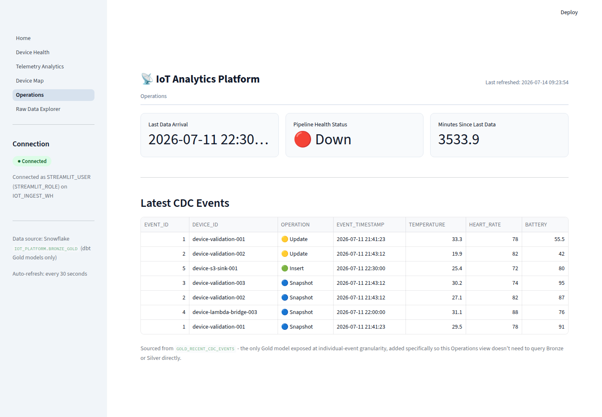
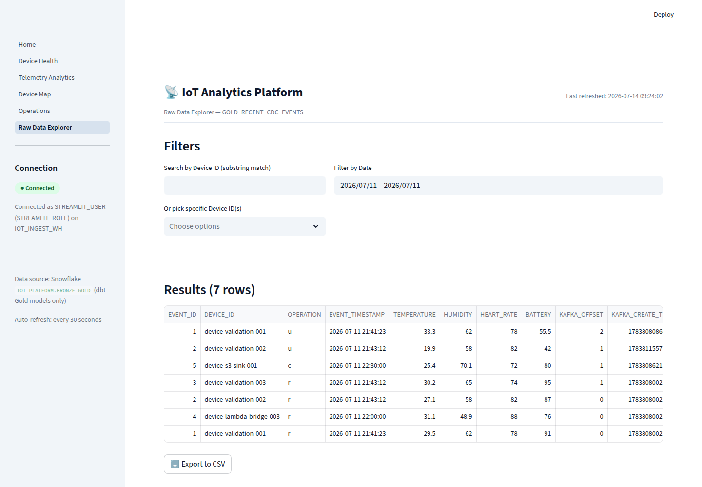

# IoT Data Migration Platform

### On‑Premises Device Telemetry → Real‑Time Cloud Analytics on Snowflake

An end‑to‑end, production‑style data engineering platform that migrates
simulated on‑premises IoT device telemetry into the cloud, transforms it
through a **medallion architecture** (Bronze → Silver → Gold), and serves it
through a live, auto‑refreshing **Streamlit** analytics dashboard.

Every piece of infrastructure, every configuration, every command, and every
issue encountered while building it is documented in **[`docs/`](./docs/)** —
in enough detail that the whole platform can be reproduced from scratch using
only the **AWS Management Console**.

---

## Table of contents

- [Overview](#overview)
- [Architecture](#architecture)
- [How data flows through the platform](#how-data-flows-through-the-platform)
- [Technology stack](#technology-stack)
- [Repository structure](#repository-structure)
- [The medallion data model](#the-medallion-data-model)
- [Dashboard preview](#dashboard-preview)
- [Getting started](#getting-started)
- [Documentation index](#documentation-index)
- [Security & configuration](#security--configuration)
- [Design decisions](#design-decisions)
- [Troubleshooting & operations](#troubleshooting--operations)

---

## Overview

This project simulates a fleet of wearable IoT devices (heart rate,
temperature, humidity, battery, GPS location), streams their telemetry
through a realistic on‑prem‑to‑cloud ingestion pipeline, and lands it in
Snowflake for analytics — exactly the kind of migration a company would run
when moving an existing on‑premises IoT/CDC pipeline to the cloud.

It was built as a complete reference implementation, not a toy demo:

- **Change Data Capture (CDC)**, not just message streaming — PostgreSQL is
  the operational system of record, and every insert/update/delete is
  captured via Debezium logical replication, exactly as it would be in a real
  on‑prem migration.
- **Self‑managed Apache Kafka** (KRaft mode) as the ingestion backbone,
  fronted by Kafka Connect running four independent, purpose‑built
  connectors.
- **A layered warehouse model** (Bronze/Silver/Gold) built with dbt Core,
  with automated data‑quality tests at every layer.
- **A least‑privilege security model throughout** — no SSH, no public IPs
  (except the dashboard), no static passwords, one narrowly‑scoped IAM/
  Snowflake role per service.
- **A live dashboard** that only ever reads the curated Gold layer, enforced
  both in application code and at the database‑privilege level.

---

## Architecture



Everything except the dashboard host runs in **private subnets with no public
IP and no SSH** — administration is exclusively through **AWS Systems Manager
Session Manager**. Full network topology, medallion‑layer lineage, and the
reasoning behind every non‑obvious choice are in
**[docs/architecture/overview.md](./docs/architecture/overview.md)** and
**[docs/architecture/design-decisions.md](./docs/architecture/design-decisions.md)**.

## How data flows through the platform

| # | Stage | What happens |
|---|---|---|
| 1 | **IoT Device Simulator** | 5 virtual wearable devices publish telemetry over MQTT every 10s |
| 2 | **AWS IoT Core** | An IoT Rule matches the `iot-events` topic and routes messages onward |
| 3 | **AWS Lambda (Kafka bridge)** | Converts the message into a Kafka Connect schema envelope and produces it to Kafka |
| 4 | **Apache Kafka** (self‑managed, KRaft on EC2) | Central ingest bus — topic `iot-events` |
| 5 | **Kafka Connect · JDBC Sink** | Writes every event into PostgreSQL (`iot_platform.iot_events`) |
| 6 | **Kafka Connect · S3 Sink** | Archives every raw event to S3, partitioned by date/hour |
| 7 | **Kafka Connect · Debezium** | Captures PostgreSQL row‑level changes (logical replication) into topic `cdc.public.iot_events` |
| 8 | **Kafka Connect · Snowflake Sink** | Streams the CDC topic into Snowflake `BRONZE.IOT_EVENTS_RAW` via Snowpipe Streaming |
| 9 | **dbt Core** | Transforms Bronze → Silver (cleaned/typed/deduped) → Gold (business marts) |
| 10 | **Streamlit dashboard** | Reads only the Gold layer; auto‑refreshes every 30 seconds |

---

## Technology stack

| Layer | Technology |
|---|---|
| Infrastructure as Code | AWS CDK (Python) |
| Device simulation | AWS IoT Device Simulator (SO0041) |
| Message ingestion | AWS IoT Core, AWS Lambda |
| Streaming platform | Apache Kafka 4.0.2 (KRaft mode, Docker Compose on EC2) |
| Stream processing | Kafka Connect (distributed mode) |
| Change data capture | Debezium PostgreSQL connector |
| Operational database | PostgreSQL 16 on EC2 |
| Object storage | Amazon S3 (raw backup) |
| Cloud data warehouse | Snowflake (Snowpipe Streaming ingestion) |
| Transformation | dbt Core + dbt‑snowflake |
| Analytics UI | Streamlit + pydeck |
| Secrets management | AWS Secrets Manager (zero static passwords) |
| Remote administration | AWS Systems Manager Session Manager (zero SSH) |
| Authentication (Snowflake) | RSA key‑pair auth per service (zero passwords) |

---

## Repository structure

```
AWS-Hackathon/
├── README.md                      ← you are here
├── CLAUDE.md                      ← project working agreements
│
├── docs/                          ← full documentation (see below)
│   ├── architecture/              ← system design, diagrams, rationale
│   ├── deployment/                ← 15 step-by-step console deployment guides
│   ├── operations/                ← validation, troubleshooting, security
│   ├── reference/                 ← configuration-values placeholder reference
│   └── screenshots/               ← live dashboard screenshots
│
├── infra/                         ← infrastructure as code + deployment artifacts
│   ├── device-simulator/          ← patched IoT Device Simulator CloudFormation template
│   ├── database/                  ← CDK stack: PostgreSQL + Bastion EC2
│   ├── kafka/                     ← CDK stacks: Kafka broker, Kafka Connect, Lambda bridge
│   │   ├── connectors/            ← JDBC Sink, S3 Sink, Debezium, Snowflake Sink configs
│   │   └── lambda_bridge/         ← IoT Core → Kafka bridge Lambda source
│   ├── snowflake/                 ← Snowflake setup SQL (Bronze, dbt role, dashboard role)
│   └── streamlit/                 ← CDK stack + systemd unit for the dashboard host
│
├── dbt/iot_platform/               ← dbt project
│   └── models/
│       ├── bronze/                ← staging view over the raw Snowpipe table
│       ├── silver/                ← cleaned, typed, deduplicated table
│       └── gold/                  ← business-ready marts consumed by the dashboard
│
└── streamlit_app/                 ← the dashboard application
    ├── Home.py                    ← Executive Overview page
    └── pages/                     ← Device Health, Telemetry Analytics, Device Map,
                                       Operations, Raw Data Explorer
```

---

## The medallion data model

| Layer | Purpose | Materialization | Key models |
|---|---|---|---|
| **Bronze** | Raw Debezium CDC envelope, exactly as ingested — schema‑on‑read | Table (Snowpipe Streaming) + staging view | `IOT_EVENTS_RAW`, `stg_iot_events` |
| **Silver** | One deduplicated, typed, current‑state row per device event, with data‑quality filters | Table | `iot_events_clean` |
| **Gold** | Business‑ready marts — the *only* layer the dashboard is allowed to query | Tables + one view | `gold_latest_device_status`, `gold_avg_temperature_by_device`, `gold_avg_heart_rate_by_device`, `gold_battery_health_summary`, `gold_daily_telemetry_summary`, `gold_recent_cdc_events` |

All layers carry `not_null`, `unique`, and `accepted_values` dbt tests. See
**[docs/deployment/13-dbt-transformations.md](./docs/deployment/13-dbt-transformations.md)**.

---

## Dashboard preview

The dashboard is a 6‑page Streamlit app: **Executive Overview**, **Device
Health**, **Telemetry Analytics**, **Device Map**, **Operations**, and **Raw
Data Explorer** — with sidebar navigation, a live connection‑status indicator,
30‑second auto‑refresh, and CSV export.

| Executive Overview | Device Health |
|---|---|
|  |  |

| Telemetry Analytics | Device Map |
|---|---|
|  |  |

| Operations | Raw Data Explorer |
|---|---|
|  |  |

---

## Getting started

> The full, detailed build — one console step at a time — lives in
> **[docs/deployment/](./docs/deployment/)**. This is the short version.

1. **Read the architecture** — [docs/architecture/overview.md](./docs/architecture/overview.md)
   and [design-decisions.md](./docs/architecture/design-decisions.md).
2. **Gather prerequisites** — an AWS account, a Snowflake account, and the
   placeholder values you'll need throughout:
   [docs/deployment/00-prerequisites.md](./docs/deployment/00-prerequisites.md) +
   [docs/reference/configuration-values.md](./docs/reference/configuration-values.md).
3. **Follow the deployment guide in order, steps 01 → 14** — each stage is its
   own document with exact console navigation, configuration values, and the
   real issues hit + fixes applied: see the
   **[full documentation index](./docs/README.md)**.
4. **Validate end‑to‑end** —
   [docs/operations/validation.md](./docs/operations/validation.md).

Deployment order at a glance:

`Network → Security → Device Simulator → IoT Core → PostgreSQL/Bastion →
Kafka Broker → Kafka Connect → Lambda Bridge → JDBC Sink → S3 Sink → Debezium
CDC → Snowflake Bronze → dbt (Silver/Gold) → Streamlit Dashboard`

---

## Documentation index

| Section | Contents |
|---|---|
| **[docs/README.md](./docs/README.md)** | Full documentation table of contents |
| [docs/architecture/overview.md](./docs/architecture/overview.md) | Data‑flow, network, and medallion diagrams |
| [docs/architecture/design-decisions.md](./docs/architecture/design-decisions.md) | Why each non‑obvious choice was made |
| [docs/deployment/00 → 14](./docs/deployment/) | Step‑by‑step console deployment guide, one file per stage |
| [docs/operations/validation.md](./docs/operations/validation.md) | Per‑stage and end‑to‑end validation checks |
| [docs/operations/troubleshooting.md](./docs/operations/troubleshooting.md) | Every issue encountered, its cause, and its exact fix |
| [docs/operations/security.md](./docs/operations/security.md) | Security model + the two incidents handled during the build |
| [docs/reference/configuration-values.md](./docs/reference/configuration-values.md) | Every placeholder used in the repo, explained |

---

## Security & configuration

- **No secrets in this repository — anywhere.** Only public keys, `*.example`
  templates, and Secrets Manager *references* (`${secretsManager:...}`) are
  committed. Every real credential lives only in AWS Secrets Manager.
- **No static passwords.** SSM Session Manager replaces SSH keys; IAM roles
  replace AWS access keys; Snowflake service accounts use **RSA key‑pair
  authentication** exclusively.
- **Least privilege everywhere.** Every AWS service and every Snowflake
  service account has its own narrowly‑scoped role — see
  [design-decisions.md](./docs/architecture/design-decisions.md#4-one-dedicated-leastprivilege-role-per-service).
- **Placeholders, not real values.** Anything environment‑specific
  (`<AWS_ACCOUNT_ID>`, `<SNOWFLAKE_ACCOUNT>`, `<VPC_ID>`, subnet/security‑group
  IDs, private IPs, RSA public keys, …) is a placeholder you fill in — see
  [docs/reference/configuration-values.md](./docs/reference/configuration-values.md).
- Full write‑up of the security model, plus the two credential‑exposure
  incidents that occurred during the build and exactly how each was
  remediated: [docs/operations/security.md](./docs/operations/security.md).

## Design decisions

Several choices in this build are deliberate and non‑obvious — e.g. why
self‑managed Kafka instead of Amazon MSK, why a Lambda bridge instead of IoT
Core's native Kafka rule action, why the Gold layer is a separate,
least‑privilege‑isolated schema, and why the dashboard runs on its own
dedicated public host instead of reusing existing infrastructure. All of it is
explained in
**[docs/architecture/design-decisions.md](./docs/architecture/design-decisions.md)**.

## Troubleshooting & operations

Every issue hit while building this platform — from package conflicts on
Amazon Linux, to Kafka Docker image/env‑var mismatches, to Snowflake connector
native‑library errors, to a misconfigured device simulator that silently
stopped data from flowing — is documented with its root cause and exact fix in
**[docs/operations/troubleshooting.md](./docs/operations/troubleshooting.md)**.
