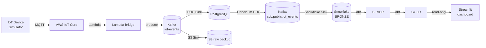

# IoT Data Migration Platform — On‑Prem Telemetry → Snowflake Analytics

An end‑to‑end data engineering project that migrates simulated on‑premises IoT
device telemetry into a cloud analytics stack, following a **medallion
architecture** (Bronze → Silver → Gold) and ending in a live **Streamlit**
dashboard.

```
IoT Device Simulator → AWS IoT Core → Lambda → Apache Kafka (self-managed, KRaft on EC2)
→ Kafka Connect → PostgreSQL on EC2 → Debezium CDC → Kafka → Snowflake → dbt → Streamlit
```

> **Full, reproducible documentation is in [`docs/`](./docs/).** Anyone can
> build this project from scratch by following it — every step, command,
> configuration, and issue/fix is documented, primarily via the **AWS
> Management Console (UI)**.

---

## Architecture



See [docs/architecture/overview.md](./docs/architecture/overview.md) for the
full data‑flow, network‑topology, and medallion diagrams, and
[design‑decisions.md](./docs/architecture/design-decisions.md) for the
rationale behind the key choices.

---

## What's in this repository

| Path | Contents |
|---|---|
| [`docs/`](./docs/) | **Complete step‑by‑step deployment & operations documentation** |
| [`infra/database/`](./infra/database/) | CDK stack — PostgreSQL + Bastion |
| [`infra/kafka/`](./infra/kafka/) | CDK stacks + Docker Compose + connector configs + Lambda bridge |
| [`infra/snowflake/`](./infra/snowflake/) | Snowflake setup SQL (Bronze, dbt role, Streamlit role) |
| [`infra/streamlit/`](./infra/streamlit/) | CDK stack + systemd unit for the dashboard host |
| [`infra/device-simulator/`](./infra/device-simulator/) | Patched IoT Device Simulator CloudFormation template |
| [`dbt/iot_platform/`](./dbt/iot_platform/) | dbt project — Bronze/Silver/Gold models + tests |
| [`streamlit_app/`](./streamlit_app/) | Streamlit dashboard application |

---

## Technology stack

AWS CDK · AWS IoT Core · AWS IoT Device Simulator · Apache Kafka 4.0.2 (KRaft) ·
Kafka Connect · Debezium · PostgreSQL 16 · Amazon S3 · AWS Lambda · AWS Secrets
Manager · AWS Systems Manager · Snowflake (Snowpipe Streaming) · dbt Core ·
Streamlit.

---

## Quick start

1. Read the [Architecture Overview](./docs/architecture/overview.md).
2. Complete the [Prerequisites](./docs/deployment/00-prerequisites.md) and
   gather your [configuration values](./docs/reference/configuration-values.md).
3. Follow the [deployment guide](./docs/README.md) steps **01 → 14** in order.
4. Validate with [operations/validation.md](./docs/operations/validation.md).

---

## Security & configuration

- **No secrets in this repository.** Only public keys, `*.example` templates,
  and Secrets Manager *references* are committed. All real credentials live in
  AWS Secrets Manager; Snowflake uses RSA key‑pair auth.
- **Placeholders**, e.g. `<AWS_ACCOUNT_ID>`, `<SNOWFLAKE_ACCOUNT>`, `<VPC_ID>`,
  are environment‑specific values you supply — see
  [docs/reference/configuration-values.md](./docs/reference/configuration-values.md).
- The full security model and the incidents handled during the build are in
  [docs/operations/security.md](./docs/operations/security.md).
