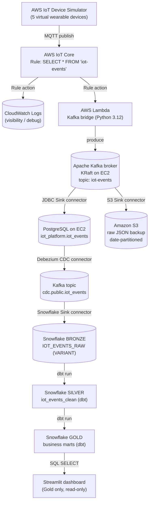
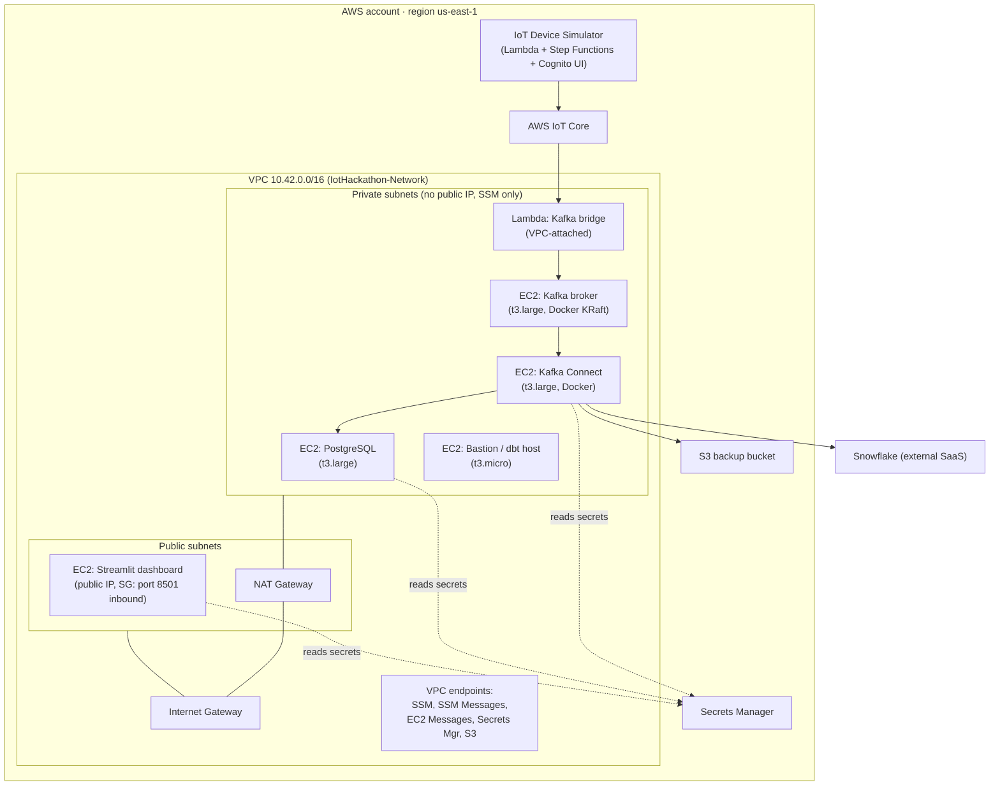
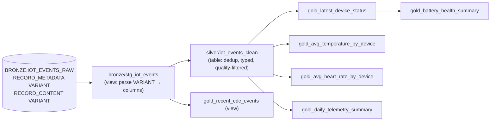

# Architecture Overview

This project implements an end‑to‑end IoT data platform that migrates
simulated on‑premises device telemetry into a cloud analytics stack. It
follows a **medallion architecture** (Bronze → Silver → Gold) and ends in a
live analytics dashboard.

> Every value shown in angle brackets (e.g. `<AWS_ACCOUNT_ID>`,
> `<SNOWFLAKE_ACCOUNT>`) is a placeholder you replace with your own. See
> [reference/configuration-values.md](../reference/configuration-values.md).

---

## 1. Approved pipeline

```
AWS IoT Device Simulator
      │  (MQTT publish, topic: iot-events)
      ▼
AWS IoT Core  ──►  (IoT Rule action → CloudWatch Logs, for visibility)
      │  (IoT Rule action → Lambda)
      ▼
AWS Lambda "Kafka bridge"
      │  (produce)
      ▼
Apache Kafka  (self-managed, KRaft mode, Docker on EC2, topic: iot-events)
      ├──►  Kafka Connect · JDBC Sink        ──►  PostgreSQL on EC2 (iot_platform.iot_events)
      └──►  Kafka Connect · S3 Sink          ──►  Amazon S3 (raw JSON, date-partitioned)
                                   │
PostgreSQL ──►  Kafka Connect · Debezium CDC ──►  Kafka topic: cdc.public.iot_events
                                   │
                                   ▼
Kafka Connect · Snowflake Sink (Snowpipe Streaming) ──► Snowflake BRONZE.IOT_EVENTS_RAW
                                   │
                                   ▼
dbt Core  (Bronze → Silver → Gold transformations)
                                   │
                                   ▼
Streamlit dashboard  (reads Gold models only)
```

### End‑to‑end data flow (diagram)



---

## 2. AWS infrastructure topology

Everything runs inside a single VPC. Compute lives in **private subnets**
with **no SSH and no public IPs** — administration is exclusively through
**AWS Systems Manager (SSM) Session Manager**. The one exception is the
Streamlit host, which sits in a **public subnet** because the dashboard needs
a browsable URL.



**Network policy summary**

| Component | Subnet | Public IP | Inbound | Admin access |
|---|---|---|---|---|
| PostgreSQL EC2 | private | none | 5432 from Bastion + Kafka‑client SG | SSM only |
| Bastion / dbt host | private | none | none | SSM only |
| Kafka broker EC2 | private | none | 9092 from Kafka‑client SG | SSM only |
| Kafka Connect EC2 | private | none | 8083 from Bastion SG | SSM only |
| Lambda bridge | private (VPC) | n/a | n/a | n/a |
| Streamlit EC2 | **public** | yes | **8501 from anywhere** | SSM only |

---

## 3. Medallion data model (Snowflake + dbt)



| Layer | Purpose | Materialization |
|---|---|---|
| **Bronze** | Raw Debezium CDC envelopes, exactly as ingested (schema‑on‑read) | table (ingested) + staging view |
| **Silver** | One deduplicated, typed, current‑state row per device event, with data‑quality filters | table |
| **Gold** | Business‑ready marts consumed by the dashboard | tables + one view |

> **Schema‑naming note:** dbt's default `generate_schema_name` concatenates
> the connection's default schema with each model's custom `+schema`, so the
> layers physically materialize as `IOT_PLATFORM.BRONZE_BRONZE`,
> `IOT_PLATFORM.BRONZE_SILVER`, and `IOT_PLATFORM.BRONZE_GOLD`. The dashboard
> therefore reads from `IOT_PLATFORM.BRONZE_GOLD`. See
> [operations/troubleshooting.md](../operations/troubleshooting.md).

---

## 4. Deployment order

The stack must be built bottom‑up because each stage depends on the previous
one. This is also the reading order of the
[deployment guide](../deployment/):

1. Network foundation (VPC, subnets, NAT, security groups, VPC endpoints)
2. Security foundation (S3 backup bucket, Secrets Manager)
3. IoT Device Simulator
4. AWS IoT Core (Thing, certificate, policy, rule)
5. PostgreSQL + Bastion (database EC2)
6. Kafka broker (EC2 + Docker + KRaft)
7. Kafka Connect worker (EC2 + Docker)
8. Lambda Kafka bridge
9. JDBC Sink connector (Kafka → PostgreSQL)
10. S3 Sink connector (Kafka → S3 raw backup)
11. Debezium CDC connector (PostgreSQL → Kafka)
12. Snowflake Bronze + Snowflake Sink connector
13. dbt Core transformations (Silver + Gold)
14. Streamlit dashboard

---

## 5. Technology summary

| Concern | Technology |
|---|---|
| Infrastructure as code | AWS CDK (Python) |
| Device simulation | AWS IoT Device Simulator (SO0041) |
| Ingest bus | Self‑managed Apache Kafka 4.0.2 (KRaft, Docker Compose) |
| Stream processing | Kafka Connect (distributed) |
| Change data capture | Debezium PostgreSQL connector |
| Operational database | PostgreSQL 16 on EC2 |
| Cloud warehouse | Snowflake (Snowpipe Streaming ingestion) |
| Transformations | dbt Core + dbt‑snowflake |
| Dashboard | Streamlit |
| Secrets | AWS Secrets Manager (no static passwords anywhere) |
| Remote administration | AWS SSM Session Manager (no SSH) |

For the reasoning behind the non‑obvious choices (self‑managed Kafka instead
of MSK, the Lambda bridge, key‑pair auth, etc.), see
[design-decisions.md](./design-decisions.md).
